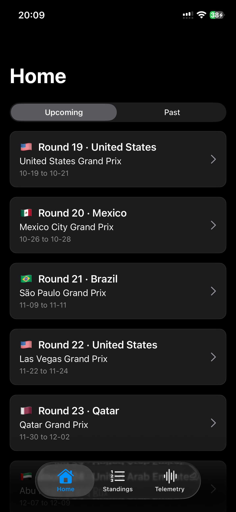
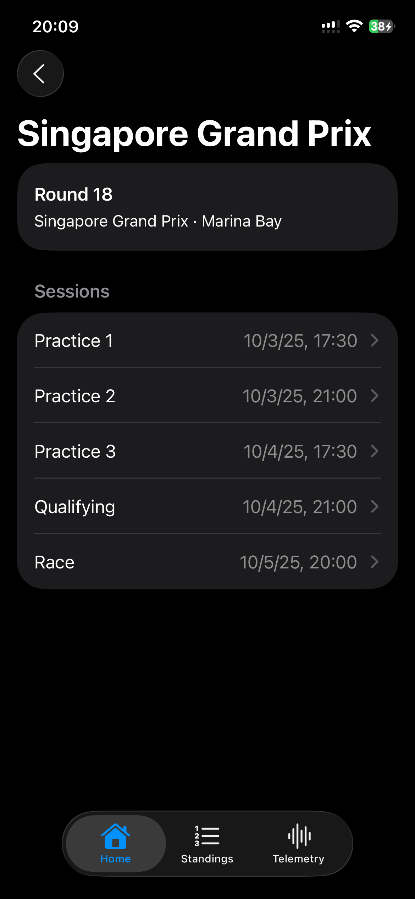
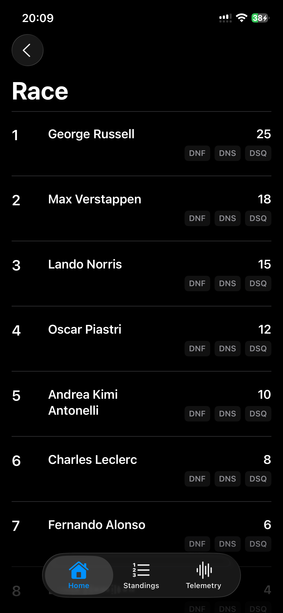
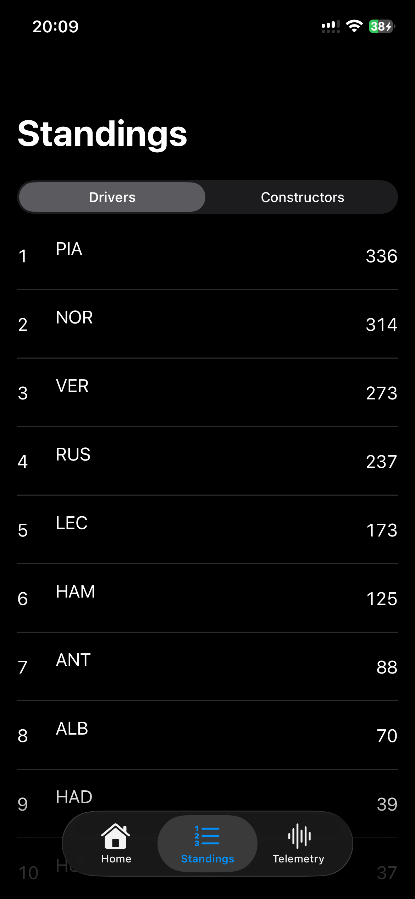
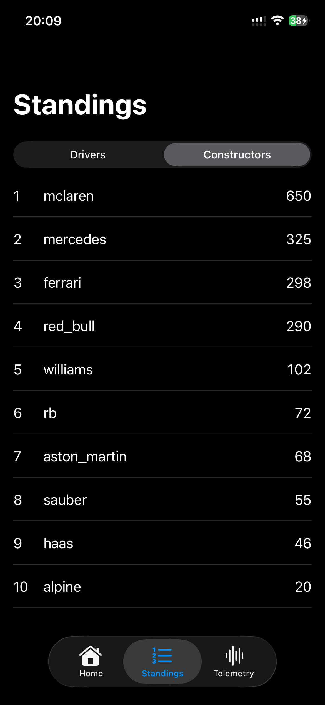
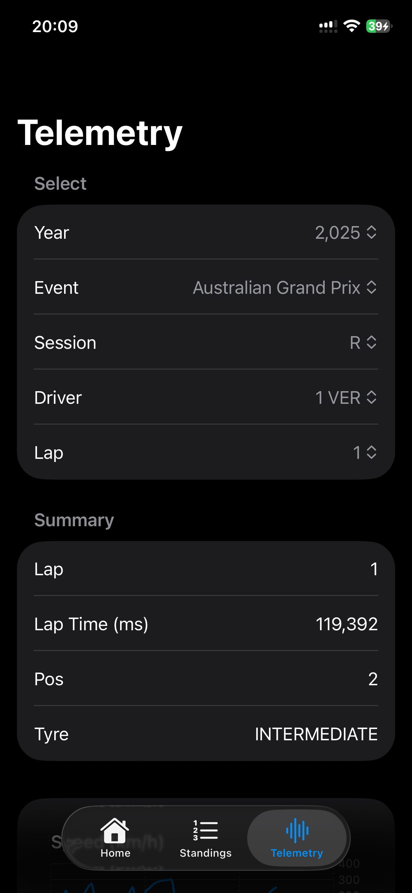
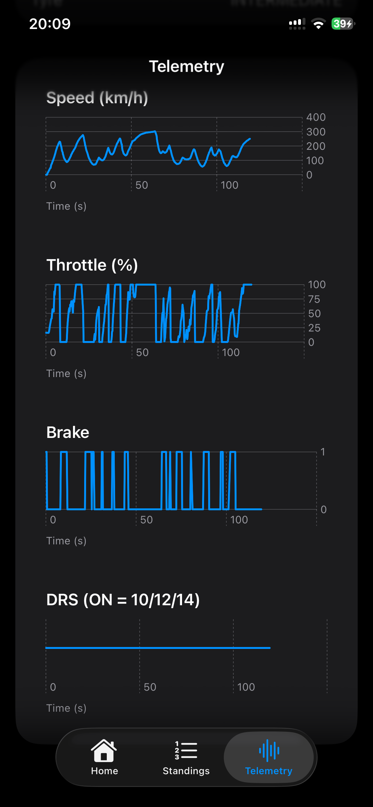

# Race Savant

Lightweight iOS app that visualizes Formula 1 telemetry (live & historical).  
Frontend: SwiftUI | Backend: FastAPI.  
Data sources: Fast‑F1, jolpica‑F1 API, Open‑F1 API.

Screenshots

<table>
  <tr>
    <td></td>
    <td></td>
    <td></td>
  </tr>
  <tr>
    <td></td>
    <td></td>
    <td></td>
  </tr>
  <tr>
    <td></td>
    <td></td>
    <td></td>
  </tr>
  
</table>

Quick features
- Session list (Practice/Quali/Race)
- Telemetry graphs: speed, RPM, throttle, brake, gear
- Lap comparison and deltas
- Configurable data sources (Fast‑F1, jolpica, Open‑F1)

Tech stack
- iOS: SwiftUI (Swift)
- Backend: FastAPI (Python)
- Data libs/APIs: Fast‑F1, jolpica‑F1 API, Open‑F1 API
